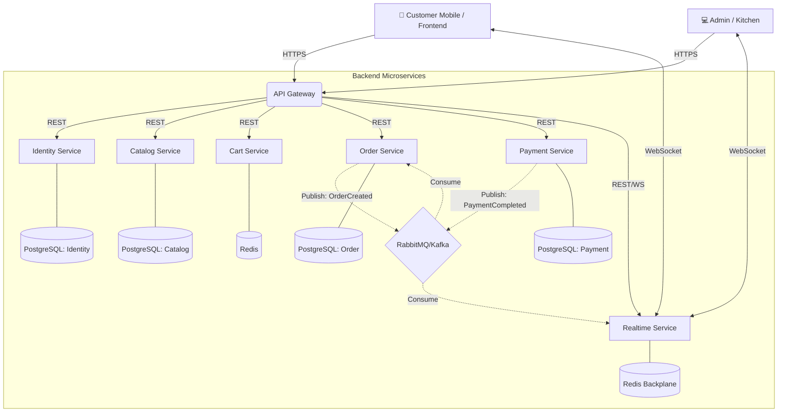

# 🍽️ Realtime Food Ordering System (Microservices Architecture)

> **A production-grade, realtime restaurant ordering platform rebuilt with Microservices on Kubernetes.**

This project is a comprehensive solution for restaurants and cafes, enabling customers to order via QR codes at their tables while Kitchen and Admin staff receive updates instantly. It is built to be robust, secure, and highly scalable using modern distributed system patterns.

---

## 🚀 Key Features

- **📱 QR Code Ordering**: Customers scan a QR code to access the menu tied to their specific table (No app download required).
- **⚡ Realtime Updates**: Instant notifications for Order Status (Kitchen -> Customer) and New Orders (Customer -> Kitchen) using **SignalR** & **RabbitMQ**.
- **💳 Integrated Payments**: Seamless support for MoMo, ZaloPay, VNPay, and **SePay** for automated webhook reconciliation.
- **🛡️ Secure Architecture**: API Gateway routing, strict separation of concerns, and JWT authentication.
- **🧑‍🍳 Kitchen Dashboard**: Live pipeline of orders (Pending -> Cooking -> Served).
- **📈 High Availability & Scale**: Deployed on **Kubernetes** with Auto-scaling (HPA), separated databases per service, and Redis caching.

---

## 🛠️ Technology Stack

We use a **Microservices Architecture** approach combined with **Clean Architecture** principles inside each service to ensure maintainability and independent scalability.

### **Backend (.NET 8 & Microservices)**
- **Framework**: ASP.NET Core Web API 8.0
- **API Gateway**: Ocelot / YARP (or NGINX Ingress on K8s)
- **Service Communication**: REST API (Synchronous) & RabbitMQ (Asynchronous Event-Driven)
- **Databases (Physical Isolation)**: PostgreSQL (Separate DB instance/schema per service)
- **Caching**: Redis (for Cart Service and SignalR backplane)
- **Realtime**: SignalR
- **Architecture**: Microservices & Domain-Driven Design (DDD)

### **Frontend (Next.js 15)**
- **Framework**: Next.js App Router
- **Language**: TypeScript
- **Styling**: TailwindCSS
- **State Management**: Zustand
- **Realtime Client**: @microsoft/signalr

### **DevOps & Infrastructure**
- **Containerization**: Docker & Docker Compose
- **Orchestration**: Kubernetes (Minikube / EKS / GKE)
- **Monitoring**: Prometheus & Grafana

---

## 🏗️ Architecture Overview



---

## � Project Structure

```bash
bunbo-system/
├── backend/                # Microservices Backend (.NET 8)
│   ├── ApiGateway/              # API Gateway (Ocelot/YARP)
│   ├── BunBo.SharedKernel/      # Shared components (Exceptions, CQRS, Base Entities)
│   ├── IdentityService/         # Auth, Users, Roles
│   ├── CatalogService/          # Products, Menus, Options
│   ├── CartService/             # Shopping Cart (Redis)
│   ├── OrderService/            # Order Management & Processing
│   ├── PaymentService/          # SePay / VNPay Integration
│   ├── RealtimeService/         # SignalR Hubs
│   ├── docker-compose.yml       # Local Infrastructure (DBs, MQ, Redis)
│   └── sprint_schedule.md       # Detailed Sprint Planning
│
├── frontend/               # Next.js Application
│   ├── src/
│   │   ├── app/            # App Router Pages
│   │   ├── store/          # Zustand State
│   │   └── services/       # API & SignalR services
│   └── tailwind.config.ts
└── kubernetes/             # K8s Manifests (Deployments, Services, ConfigMaps)
```

---

## 🗺️ Sprint Roadmap & Task Breakdown

Quá trình chuyển đổi từ Monolithic sang Microservices được chia thành 5 Sprint cụ thể để code lại từ đầu một cách có hệ thống.

### 🚀 Sprint 1: Nền tảng Core & Infrastructure (Tuần 1-2)
**Mục tiêu:** Thiết lập khung sườn chung, cấu trúc các thư mục Microservice nền tảng và dịch vụ phân quyền (Identity Service).
- [ ] Tạo dự án thư viện dùng chung `BunBo.SharedKernel`.
- [ ] Cấu hình API Gateway dự án mới (`ApiGateway`).
- [ ] Tạo khung sườn cho **Identity Service** (`API`, `Application`, `Domain`, `Infrastructure`).
- [ ] Cấu hình Solution references cho các project trên.
- [ ] Di chuyển các Base Entity, Exceptions, Interfaces cơ sở sang `BunBo.SharedKernel`.
- [ ] Setup `docker-compose.yml` gốc chứa: PostgreSQL, RabbitMQ, Redis.
- [ ] Xây dựng Database schema & Migration cho **Identity Service**.
- [ ] Xây dựng logic Authentication/Authorization (JWT) vào Identity Service.
- [ ] Cấu hình Ocelot (hoặc YARP) trong API Gateway để định tuyến request Authentication vào Identity Service.
- [ ] Chạy kiểm thử xác nhận việc đăng nhập qua Gateway.

### 🛒 Sprint 2: Core Business - Catalog & Cart (Tuần 3)
**Mục tiêu:** Quản lý dữ liệu tĩnh (Menu) và dữ liệu tạm thời (Cart).
- [ ] Tạo module cho **Catalog Service**.
  - [ ] Cấu hình DbContext & Migration (PostgreSQL - Catalog Schema).
  - [ ] Xây dựng logic CRUD Món ăn, Tuỳ chọn, Danh mục.
  - [ ] Cấu hình route trên API Gateway cho Product/Menu.
- [ ] Tạo module cho **Cart Service**.
  - [ ] Tích hợp Redis làm Storage chính qua `StackExchange.Redis`.
  - [ ] Xây dựng logic Thêm/Bớt/Sửa giỏ hàng.
  - [ ] Cấu hình route trên API Gateway cho Cart.
- [ ] Thiết lập giao tiếp đồng bộ (REST qua HttpClient/gRPC) để Cart Service lấy giá mới nhất từ Catalog Service khi checkout.

### 📦 Sprint 3: Core Business - Order & Realtime (Tuần 4)
**Mục tiêu:** Hoàn thiện luồng đặt món phức tạp nhất bằng RabbitMQ và SignalR.
- [ ] Tạo module cho **Order Service**.
  - [ ] Cấu hình DbContext & Migration (PostgreSQL - Order Schema).
  - [ ] Xây dựng API Checkout nhận dữ liệu từ Cart.
  - [ ] Tích hợp `MassTransit` để xuất bản (Publish) event `OrderCreatedEvent` vào RabbitMQ.
- [ ] Tạo module cho **Realtime Service**.
  - [ ] Di chuyển/Xây dựng toàn bộ SignalR Hubs sang service này.
  - [ ] Sử dụng Redis Backplane cho SignalR (để scale multiple instances).
  - [ ] Cấu hình RabbitMQ Consumer để nhận `OrderCreatedEvent` và bắn WebSocket cho nhà bếp (Kitchen Dashboard).

### � Sprint 4: Payment & Notification (Tuần 5)
**Mục tiêu:** Xử lý thanh toán và đối soát với SePay.
- [ ] Tạo module cho **Payment Service**.
  - [ ] Tích hợp API của **SePay** để tạo link thanh toán/QR Code.
  - [ ] Xây dựng endpoint nhận Webhook từ SePay.
  - [ ] Publish `PaymentCompletedEvent` vào RabbitMQ khi Webhook xác nhận thành công.
- [ ] Cập nhật **Order Service**:
  - [ ] Tạo Consumer nhận `PaymentCompletedEvent` từ RabbitMQ.
  - [ ] Tự động cập nhật trạng thái Order thành `Paid` / Đẩy vào bếp nấu.
- [ ] Cập nhật **Realtime Service**:
  - [ ] Nhận event `OrderUpdated` từ RabbitMQ để báo cho khách hàng đã thanh toán thành công.

### 🚢 Sprint 5: Kubernetes & Scale (Tuần 6)
**Mục tiêu:** Container hoá toàn bộ và triển khai lên K8s, tích hợp Auto-scaling.
- [ ] Dockerize: Viết `Dockerfile` tối ưu (multi-stage) cho tất cả 6 services.
- [ ] Viết Kubernetes Manifests (`Deployments`, `Services`, `Ingress`, `ConfigMaps/Secrets`) cho từng Service.
- [ ] Triển khai NGINX Ingress Controller làm external Gateway thay thế Ocelot local (nếu cần).
- [ ] Cấu hình Horizontal Pod Autoscaler (HPA) cho `OrderService` và `RealtimeService` dựa trên CPU metrics.
- [ ] Triển khai hệ thống Monitoring (Prometheus, Grafana).
- [ ] Đóng và test toàn bộ luồng nghiệp vụ trên môi trường K8s giả lập (Minikube).

---

## 🚦 Getting Started (Local Development)

### Prerequisites
- [Docker & Docker Compose](https://www.docker.com/)
- [.NET 8 SDK](https://dotnet.microsoft.com/download/dotnet/8.0)
- [Node.js 18+](https://nodejs.org/)

### Installation & Run

1.  **Clone the repository**
    ```bash
    git clone https://github.com/griox/bun-bo-ordering.git
    cd bun-bo-ordering
    ```

2.  **Start the Infrastructure (Databases, RabbitMQ, Redis)**
    ```bash
    cd backend
    docker-compose up -d
    ```

3.  **Run the Microservices** (Will be updated as sprints progress)
    *   Start API Gateway
    *   Start Identity Service
    *   *...Other services*

4.  **Run the Frontend Client**
    ```bash
    cd ../frontend
    npm install
    npm run dev
    ```
    *App will start at `http://localhost:3000`*

---

## 📜 License

This project is open-source and available under the [MIT License](LICENSE).
