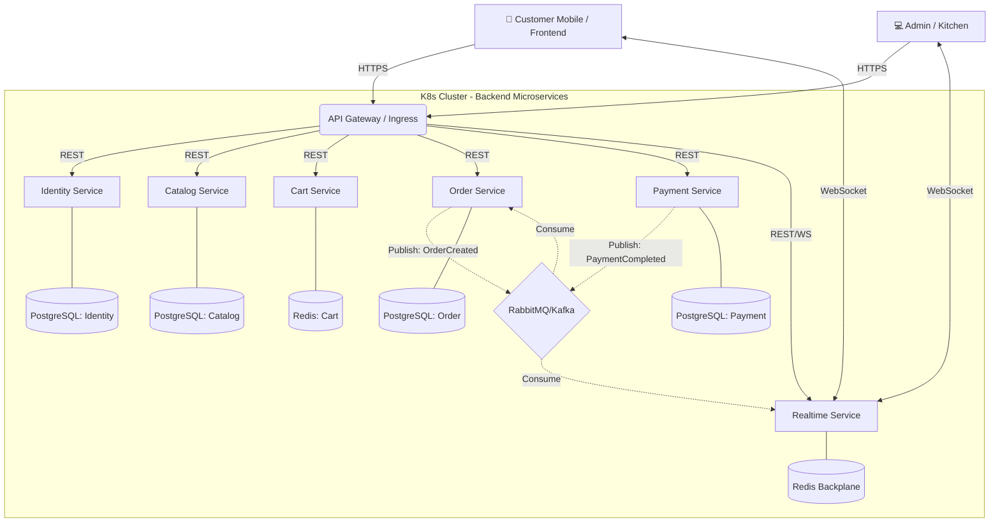

# � ĐỒ ÁN: Hệ Thống Thương Mại Điện Tử (Food Ordering System)
> **Kiến trúc Microservices trên nền tảng Kubernetes**

Dự án này là sản phẩm đồ án tốt nghiệp, áp dụng kiến trúc **Microservices** cho miền nghiệp vụ đặt đồ ăn/nhà hàng (Food Ordering), được triển khai trên cụm **Kubernetes** với đầy đủ các cấu hình về auto-scaling, monitoring (giám sát metrics) và đảm bảo tính sẵn sàng cao (High Availability).

---

## 🎯 Mục Tiêu Đồ Án
- **Mục tiêu học thuật:** Nắm vững và phân tích chuyên sâu kiến trúc **Microservices** so với Monolithic. Nắm bắt các nguyên tắc thiết kế ứng dụng phân tán hiện đại và nền tảng **Kubernetes (K8s)**.
- **Mục tiêu kỹ thuật:** Chuyển đổi từ hệ thống nguyên khối sang Microservices; Container hóa; Cấu hình HPA (Horizontal Pod Autoscaler), Service Mesh/Ingress, và tích hợp các công cụ giám sát (Prometheus, Grafana), logging (ELK/Loki).
- **Mục tiêu đánh giá:** Thực hiện Load Testing (JMeter/K6) và Chaos Testing để đánh giá mức độ chịu tải, độ trễ và khả năng phục hồi của hệ thống.

---

## 🚀 Key Features

- **📱 QR Code Ordering**: Khách hàng quét mã QR để gọi món tại bàn (Không cần cài app).
- **⚡ Realtime Notifications**: Thông báo trạng thái đơn tức thời qua **SignalR** & **RabbitMQ** (đáp ứng module Notification).
- **💳 Integrated Payments**: Hỗ trợ thanh toán tự động qua **SePay**, MoMo, VNPay (Module Payment).
- **🛡️ Secure Architecture**: API Gateway phân giải request, xác thực qua JWT Authentication.
- **🧑‍🍳 Kitchen Dashboard**: Màn hình quản lý realtime cho nhà bếp.
- **📈 K8s & Auto-scaling**: Triển khai hoàn toàn trên **Kubernetes** với cấu hình ReplicaSet, HPA, ConfigMaps, Secrets và Deploy bằng Helm Charts.

---

## 🛠️ Technology Stack & Ánh xạ Microservices

Hệ thống tuân thủ pattern **Database per Service**, giao tiếp qua REST API (Đồng bộ) và RabbitMQ (Bất đồng bộ).

### **Backend (Microservices - .NET 8)**
*Theo yêu cầu nghiệp vụ, hệ thống chia thành 6 modules chính:*
- **API Gateway**: Ocelot / YARP (hoặc NGINX Ingress trên K8s) (Định tuyến, JWT).
- **Identity Service** *(User Service)*: Đăng nhập, phân quyền, quản lý tài khoản.
- **Catalog Service** *(Product Service)*: Quản lý thực đơn, món ăn, danh mục.
- **Cart Service** *(Cart Module)*: Quản lý giỏ hàng nhanh bằng **Redis**.
- **Order Service**: Xử lý tạo và quản lý luồng đơn hàng.
- **Payment Service**: Xử lý thanh toán webhook và đối soát.
- **Realtime Service** *(Notification Service)*: Gửi thông báo WebSocket / Push Notification xuống Client và Nhà bếp.

### **Frontend (Next.js 15)**
- **Framework**: Next.js App Router (TypeScript, TailwindCSS, Zustand).
- **Realtime Client**: `@microsoft/signalr`.

### **DevOps, Kubernetes & Monitoring**
- **Containerization**: Docker & Docker Compose.
- **Orchestration**: Kubernetes (K8s) (Deployment, Service, HPA, Ingress).
- **Package Manager**: Helm Charts.
- **Monitoring & Alerting**: Prometheus & Grafana.
- **Logging**: ELK Stack / Loki.
- **Testing**: K6 / JMeter (Load Testing).

---

## 🏗️ Architecture Overview



---

## 🗺️ Checklist Tiến Độ (Bám sát yêu cầu đồ án)

Tiến độ phát triển dự án được chia thành 5 giai đoạn cốt lõi:

### 📖 Giai đoạn 1 – Nghiên cứu lý thuyết & Kiến trúc sơ bộ
- [x] Phân tích sự kiện Microservices vs Monolithic.
- [x] Nghiên cứu Containerization với Docker.
- [x] Khảo sát Kubernetes core components (Service, Pod, ConfigMap, Ingress).
- [ ] Nghiên cứu Auto-scaling (HPA) và Monitoring (Prometheus/Grafana).

### � Giai đoạn 2 – Phân tích & Thiết kế Microservices
- [x] Khảo sát miền nghiệp vụ Food Ordering (QR Code ra món).
- [x] Thiết kế chia nhỏ 6 services độc lập: Identity, Catalog, Cart, Order, Payment, Realtime.
- [x] Thiết kế mô hình dữ liệu **Database per Service**.
- [x] Khởi tạo các repository Backend, Frontend, SharedKernels.
- [ ] Cấu trúc sơ đồ Giao tiếp liên services bằng RabbitMQ.

### 💻 Giai đoạn 3 – Triển khai Source Code (Các Sprints)

🔹 **Sprint 1: Nền tảng Core, API Gateway & Identity Service**
- [x] Thiết lập `docker-compose.yml` gốc (PostgreSQL, RabbitMQ, Redis).
- [x] Tạo dự án thư viện dùng chung `BunBo.SharedKernel` (Exceptions, CQRS, Base Entities).
- [x] Thiết lập `API Gateway` cơ bản.
- [x] Xây dựng `Identity Service` (Authentication/Authorization với JWT, Database độc lập).

🔹 **Sprint 2: Core Business - Catalog & Cart**
- [x] Xây dựng `Catalog Service` (CRUD Món ăn, Danh mục, Database độc lập).
- [x] Xây dựng `Cart Service` (Sử dụng Redis làm Storage).
- [x] Cấu hình route trên API Gateway cho Catalog và Cart.
- [x] Tích hợp giao tiếp REST (gRPC/HttpClient) giữa Cart và Catalog để đồng bộ giá.

🔹 **Sprint 3: Core Business - Order & Realtime (Message Queue)**
- [x] Xây dựng `Order Service` (Xử lý đặt hàng, Database độc lập).
- [x] Tích hợp RabbitMQ để Publish sự kiện `OrderCreatedEvent`.
- [x] Xây dựng `Realtime Service` (Sử dụng SignalR & Redis Backplane).
- [x] Cấu hình Consume RabbitMQ trong Realtime Service để nhận event và đẩy WebSockets xuống Kitchen Dashboard/Client.

🔹 **Sprint 4: Payment & Tích hợp Webhook**
- [ ] Xây dựng `Payment Service` (Database độc lập).
- [ ] Tích hợp API tạo mã QR thanh toán (SePay / MoMo / VNPay).
- [ ] Cấu hình Endpoint nhận Webhook xác nhận thanh toán.
- [ ] Publish sự kiện `PaymentCompletedEvent` lên RabbitMQ để Order Service tự động cập nhật trạng thái đơn hàng.

🔹 **Sprint 5: Container hóa toàn bộ hệ thống**
- [ ] Viết `Dockerfile` tối ưu (multi-stage) cho tất cả Microservices và API Gateway.
- [ ] Test toàn bộ luồng request qua các container bằng `docker-compose` trên môi trường Local.
- [ ] Đẩy (Push) Docker Images lên Registry (Docker Hub / GitHub Packages).

### � Giai đoạn 4 – Triển khai K8s & Kiểm thử (Trọng tâm Đồ án)
- [ ] Viết toàn bộ K8s manifest files (`Deployments`, `Ingress`, `Secrets`, v.v.).
- [ ] Áp dụng **Helm Charts** để đóng gói và triển khai lên Minikube/Cluster.
- [ ] Cài đặt **Prometheus + Grafana**, cấu hình Alerting cơ bản.
- [ ] Cấu hình **HPA (Horizontal Pod Autoscaler)** scaling dựa trên tài nguyên CPU.
- [ ] Thực hiện **Load Testing** bằng JMeter/K6, phân tích metrics từ Grafana.
- [ ] Thử nghiệm **Chaos Testing** (mô phỏng node/pod failure) để kiểm chứng HA.

### 🎓 Giai đoạn 5 – Tổng kết
- [ ] Rà soát Code Quality, Refactoring.
- [ ] Viết Báo cáo Đồ án tốt nghiệp chi tiết.
- [ ] Chuẩn bị Slides bảo vệ.
- [ ] Record video Demo, nộp sản phẩm hoàn thiện.

---

## 🚦 Getting Started (Local Development)

### Prerequisites
- [Docker & Docker Compose](https://www.docker.com/)
- [.NET 8 SDK](https://dotnet.microsoft.com/download/dotnet/8.0)
- [Node.js 18+](https://nodejs.org/)
- K8s local (Minikube / Docker Desktop k8s) đang thiết lập - *để test Phase 4.*

### Chạy hệ thống môi trường Local (Với Docker Compose)

1.  **Clone repository**
    ```bash
    git clone https://github.com/griox/bun-bo-ordering.git
    cd bun-bo-ordering
    ```

2.  **Khởi động Infrastructure (PostgreSQL, RabbitMQ, Redis)**
    ```bash
    cd backend
    docker-compose up -d
    ```

3.  **Khởi động các Microservices**
    - Mở IDE (Visual Studio / Rider) và chạy các dịch vụ `ApiGateway`, `IdentityService`, v.v. hoặc lệnh `dotnet run`.

4.  **Khởi động Frontend Next.js**
    ```bash
    cd ../frontend
    npm install
    npm run dev
    ```
    *App sẽ khả dụng tại: `http://localhost:3000`*

---

## 📜 License
Dự án được triển khai dưới dạng Open-Source phục vụ mục đích Đồ án Tốt nghiệp. Cấp phép theo [MIT License](LICENSE).
