# 🍽️ Realtime Food Ordering System

> **A production-grade, realtime restaurant ordering platform built with modern technologies.**

This project is a comprehensive solution for restaurants and cafes, enabling customers to order via QR codes at their tables while Kitchen and Admin staff receive updates instantly. It is built to be robust, secure, and scalable.

---

## 🚀 Key Features

- **📱 QR Code Ordering**: Customers scan a QR code to access the menu tied to their specific table (No app download required).
- **⚡ Realtime Updates**: Instant notifications for Order Status (Kitchen -> Customer) and New Orders (Customer -> Kitchen) using **SignalR**.
- **💳 Integrated Payments**: Seamless support for MoMo, ZaloPay, and VNPay.
- **🛡️ Secure Architecture**: Strict separation of concerns, secure payment verification, and JWT authentication for management.
- **🧑‍🍳 Kitchen Dashboard**: Live pipeline of orders (Pending -> Cooking -> Served).

---

## 🛠️ Technology Stack

We use a **Clean Architecture** approach to ensure maintainability and testability.

### **Backend (.NET 8)**
- **Framework**: ASP.NET Core Web API
- **Database**: PostgreSQL (via Docker)
- **ORM**: Entity Framework Core
- **Realtime**: SignalR
- **Architecture**: Domain-Driven Design (DDD) / Clean Architecture
  - `Domain`: Core Entities & Business Rules (No dependencies)
  - `Application`: Business Logic & Interfaces
  - `Infrastructure`: Database & External Services
  - `API`: REST Endpoints & Hubs

### **Frontend (Next.js 15)**
- **Framework**: Next.js App Router
- **Language**: TypeScript
- **Styling**: TailwindCSS
- **State Management**: Zustand
- **HTTP Client**: Axios
- **Realtime Client**: @microsoft/signalr

---

## 🏗️ Architecture Overview

```mermaid
graph TD
    Client[📱 Customer Mobile] -->|HTTPS| API
    Admin[💻 Admin/Kitchen] -->|HTTPS| API
    
    subgraph Backend
        API[BunBo.API]
        SignalR[SignalR Hubs]
        App[Application Layer]
        Dom[Domain Layer]
        Infra[Infrastructure Layer]
        
        API --> App
        API --> Infra
        App --> Dom
        Infra --> Dom
        Infra --> DB[(PostgreSQL)]
    end
    
    Client <-->|WebSocket| SignalR
    Admin <-->|WebSocket| SignalR
```



---

## 🚦 Getting Started

### Prerequisites
- [Docker & Docker Compose](https://www.docker.com/)
- [.NET 8 SDK](https://dotnet.microsoft.com/download/dotnet/8.0)
- [Node.js 18+](https://nodejs.org/)

### Installation

1.  **Clone the repository**
    ```bash
    git clone https://github.com/griox/bun-bo-ordering.git
    cd bun-bo-ordering
    ```

2.  **Start the Database**
    ```bash
    cd backend
    docker-compose up -d
    ```

3.  **Apply Database Migrations**
    ```bash
    dotnet ef database update -p src/BunBo.Infrastructure -s src/BunBo.API
    ```

4.  **Run the Backend API**
    ```bash
    dotnet run --project src/BunBo.API/BunBo.API.csproj
    ```
    *API will start at `http://localhost:5215`*

5.  **Run the Frontend Client**
    ```bash
    cd ../frontend
    npm install
    npm run dev
    ```
    *App will start at `http://localhost:3000`*

---

## 📂 Project Structure

```bash
bunbo-system/
├── backend/                # .NET 8 Solution
│   ├── src/
│   │   ├── BunBo.API/           # Entry point
│   │   ├── BunBo.Application/   # Use cases & DTOs
│   │   ├── BunBo.Domain/        # Entities & Enums (Core)
│   │   └── BunBo.Infrastructure/# DbContext & Adapters
│   └── docker-compose.yml       # DB Setup
│
└── frontend/               # Next.js Application
    ├── src/
    │   ├── app/            # App Router Pages
    │   ├── store/          # Zustand State
    │   └── services/       # API & SignalR services
    └── tailwind.config.ts
```

---

## 📜 License

This project is open-source and available under the [MIT License](LICENSE).
